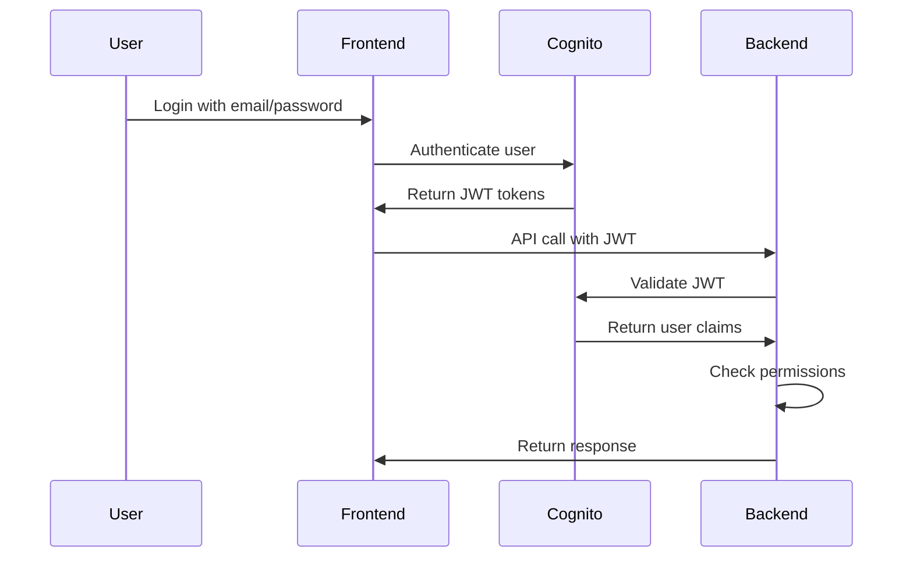

# Enterprise Authentication Integration Guide

## Frontend & Backend Development Requirements

This guide provides detailed specifications for integrating the new enterprise authentication and security features with your One Frequency React frontend and Go backend services.

## 🔧 Configuration Values

### Environment Variables to Add

**Frontend (.env)**

```bash
# Enterprise Cognito Configuration
VITE_USER_POOL_ID=us-east-2_JKsb0fPHX
VITE_USER_POOL_CLIENT_ID=4qbitb6voa560333ajlg090dh6
VITE_IDENTITY_POOL_ID=us-east-2:8af4b173-d6f5-4b86-a354-cebc4ccd0d41
VITE_COGNITO_DOMAIN=https://onefrequency-enterprise-dev.auth.us-east-2.amazoncognito.com
VITE_AUTH_REDIRECT_URI=https://app.onefrequency.ai/auth/callback
VITE_AUTH_LOGOUT_URI=https://app.onefrequency.ai/auth/logout

# Enterprise Features
VITE_ENTERPRISE_MODE=true
VITE_RBAC_ENABLED=true
```

**Backend (Go service environment)**

```bash
# Enterprise Cognito Configuration
USER_POOL_ID=us-east-2_JKsb0fPHX
USER_POOL_CLIENT_ID=4qbitb6voa560333ajlg090dh6
COGNITO_REGION=us-east-2
JWKS_URL=https://cognito-idp.us-east-2.amazonaws.com/us-east-2_JKsb0fPHX/.well-known/jwks.json

# Enterprise Features
ENTERPRISE_MODE=true
RBAC_ENABLED=true
```

---

## 🎨 Frontend Development Requirements

### 1. **New Components to Create**

#### **A. Authentication Components**

**`src/components/auth/EnterpriseLogin.tsx`**

```typescript
interface EnterpriseLoginProps {
  onLoginSuccess: (user: EnterpriseUser) => void;
  onLoginError: (error: Error) => void;
  redirectAfterLogin?: string;
}

// Features to implement:
// - Email/password login
// - OAuth flow integration
// - MFA support
// - "Remember me" functionality
// - Loading states
// - Error handling
```

**`src/components/auth/UserProfile.tsx`**

```typescript
interface UserProfileProps {
  user: EnterpriseUser;
  onProfileUpdate: (updates: Partial<EnterpriseUser>) => void;
  canEdit: boolean;
}

// Features to implement:
// - Display user tier (Standard/Premium/Admin)
// - Show service permissions
// - Department and role fields
// - Last login information
// - Editable fields based on permissions
```

**`src/components/auth/RoleBasedComponent.tsx`**

```typescript
interface RoleBasedComponentProps {
  allowedRoles: UserRole[];
  allowedTiers: UserTier[];
  fallback?: React.ReactNode;
  children: React.ReactNode;
}

// Features to implement:
// - Render children only if user has required role/tier
// - Show fallback component for unauthorized users
// - Support for multiple role checks
```

#### **B. Admin Components**

**`src/components/admin/UserManagement.tsx`**

```typescript
// Features to implement:
// - List all users with pagination
// - Filter by role, tier, department
// - Create new users
// - Edit user permissions
// - Assign users to groups
// - View user activity logs
```

**`src/components/admin/SecurityDashboard.tsx`**

```typescript
// Features to implement:
// - WAF blocked requests chart
// - Authentication failure metrics
// - User login patterns
// - Security alerts
// - Real-time monitoring
```

#### **C. Premium Features Components**

**`src/components/premium/AnalyticsDashboard.tsx`**

```typescript
// Features to implement:
// - Advanced chat analytics
// - User engagement metrics
// - Export functionality
// - Custom date ranges
// - Only accessible to Premium/Admin users
```

### 2. **Updated Routing**

**`src/App.tsx` - Add new routes:**

```typescript
// New routes to add:
<Route path="/auth/callback" component={AuthCallback} />
<Route path="/auth/logout" component={AuthLogout} />
<Route path="/profile" component={UserProfile} />
<Route path="/admin" component={AdminDashboard} />
<Route path="/admin/users" component={UserManagement} />
<Route path="/admin/security" component={SecurityDashboard} />
<Route path="/premium/analytics" component={AnalyticsDashboard} />

// Protected route wrapper
<ProtectedRoute
  path="/admin/*"
  component={AdminRoutes}
  requiredRole={["Administrators"]}
/>
```

### 3. **State Management Updates**

#### **A. User Context Enhancement**

**`src/contexts/AuthContext.tsx`**

```typescript
interface EnterpriseUser {
  userId: string;
  email: string;
  userTier: 'standard' | 'premium' | 'admin';
  servicePermissions: {
    chat: boolean;
    analytics: boolean;
    admin: boolean;
  };
  groups: string[];
  department?: string;
  role?: string;
  lastLogin: string;
  loginCount: number;
  mfaEnabled: boolean;
}

interface AuthContextType {
  user: EnterpriseUser | null;
  isAuthenticated: boolean;
  isLoading: boolean;
  login: (email: string, password: string) => Promise<void>;
  logout: () => Promise<void>;
  refreshToken: () => Promise<void>;
  hasPermission: (permission: string) => boolean;
  hasRole: (role: string) => boolean;
  hasTier: (tier: string) => boolean;
}
```

#### **B. Permission Hooks**

**`src/hooks/usePermissions.ts`**

```typescript
export const usePermissions = () => {
  const { user } = useAuth();

  return {
    canAccessChat: user?.servicePermissions.chat || false,
    canAccessAnalytics: user?.servicePermissions.analytics || false,
    canAccessAdmin: user?.servicePermissions.admin || false,
    isAdmin: user?.groups.includes('Administrators') || false,
    isPremium: user?.userTier === 'premium' || user?.userTier === 'admin',
    hasRole: (role: string) => user?.groups.includes(role) || false,
  };
};
```

### 4. **New Pages to Create**

#### **A. Authentication Pages**

**`src/pages/auth/LoginPage.tsx`**

- Enterprise login form
- OAuth login buttons
- "Forgot password" flow
- Registration link (if enabled)

**`src/pages/auth/CallbackPage.tsx`**

- Handle OAuth callback
- Token exchange
- Redirect to original destination

#### **B. Admin Pages**

**`src/pages/admin/AdminDashboard.tsx`**

- Overview of system metrics
- Quick actions
- Recent user activity

**`src/pages/admin/UserManagementPage.tsx`**

- Complete user management interface
- User creation forms
- Role assignment interface

#### **C. Profile Pages**

**`src/pages/profile/ProfilePage.tsx`**

- User profile management
- Password change
- MFA setup
- Session management

---

## 🚀 Backend Development Requirements

### 1. **New Go Modules to Create**

#### **A. Authentication Module**

**`internal/auth/cognito.go`**

```go
type CognitoAuth struct {
    UserPoolID string
    ClientID   string
    Region     string
    JWKSUrl    string
}

// Methods to implement:
func (c *CognitoAuth) ValidateToken(token string) (*UserClaims, error)
func (c *CognitoAuth) GetUserFromToken(token string) (*EnterpriseUser, error)
func (c *CognitoAuth) RefreshToken(refreshToken string) (*TokenResponse, error)
```

**`internal/auth/middleware.go`**

```go
// Middleware functions to implement:
func AuthenticationMiddleware() gin.HandlerFunc
func RequireRole(roles ...string) gin.HandlerFunc
func RequireTier(tiers ...string) gin.HandlerFunc
func RequirePermission(permission string) gin.HandlerFunc
```

#### **B. User Management Module**

**`internal/users/enterprise_user.go`**

```go
type EnterpriseUser struct {
    UserID             string                 `json:"userId" db:"user_id"`
    Email              string                 `json:"email" db:"email"`
    UserTier           string                 `json:"userTier" db:"user_tier"`
    ServicePermissions map[string]bool        `json:"servicePermissions" db:"service_permissions"`
    Groups             []string               `json:"groups" db:"groups"`
    Department         *string                `json:"department,omitempty" db:"department"`
    Role               *string                `json:"role,omitempty" db:"role"`
    CreatedAt          time.Time              `json:"createdAt" db:"created_at"`
    LastLogin          time.Time              `json:"lastLogin" db:"last_login"`
    LoginCount         int                    `json:"loginCount" db:"login_count"`
    MFAEnabled         bool                   `json:"mfaEnabled" db:"mfa_enabled"`
}

// Methods to implement:
func (u *EnterpriseUser) HasPermission(permission string) bool
func (u *EnterpriseUser) HasRole(role string) bool
func (u *EnterpriseUser) IsPremium() bool
func (u *EnterpriseUser) IsAdmin() bool
```

### 2. **New API Endpoints**

#### **A. Authentication Endpoints**

```go
// Group: /api/v1/auth
POST   /auth/login              // Handle login
POST   /auth/logout             // Handle logout
POST   /auth/refresh            // Refresh token
GET    /auth/user               // Get current user info
PUT    /auth/user               // Update user profile
```

#### **B. Admin Endpoints**

```go
// Group: /api/v1/admin (Admin only)
GET    /admin/users             // List all users
POST   /admin/users             // Create new user
PUT    /admin/users/:id         // Update user
DELETE /admin/users/:id         // Delete user
POST   /admin/users/:id/groups  // Add user to group
DELETE /admin/users/:id/groups  // Remove user from group
GET    /admin/security/metrics  // Security metrics
GET    /admin/security/logs     // Security logs
```

#### **C. Premium Feature Endpoints**

```go
// Group: /api/v1/premium (Premium/Admin only)
GET    /premium/analytics       // Advanced analytics
GET    /premium/reports         // Generate reports
POST   /premium/export          // Export data
```

### 3. **Database Schema Updates**

#### **A. Enhanced User Table**

```sql
-- Add new columns to existing users table
ALTER TABLE users ADD COLUMN user_tier VARCHAR(20) DEFAULT 'standard';
ALTER TABLE users ADD COLUMN service_permissions JSON;
ALTER TABLE users ADD COLUMN cognito_groups JSON;
ALTER TABLE users ADD COLUMN department VARCHAR(100);
ALTER TABLE users ADD COLUMN role VARCHAR(100);
ALTER TABLE users ADD COLUMN last_login TIMESTAMP;
ALTER TABLE users ADD COLUMN login_count INTEGER DEFAULT 0;
ALTER TABLE users ADD COLUMN mfa_enabled BOOLEAN DEFAULT false;
ALTER TABLE users ADD COLUMN cognito_user_id VARCHAR(255) UNIQUE;

-- Index for performance
CREATE INDEX idx_users_tier ON users(user_tier);
CREATE INDEX idx_users_cognito_id ON users(cognito_user_id);
```

#### **B. New Tables**

```sql
-- User sessions tracking
CREATE TABLE user_sessions (
    id UUID PRIMARY KEY DEFAULT gen_random_uuid(),
    user_id UUID REFERENCES users(id),
    session_token VARCHAR(255),
    ip_address INET,
    user_agent TEXT,
    created_at TIMESTAMP DEFAULT NOW(),
    expires_at TIMESTAMP,
    active BOOLEAN DEFAULT true
);

-- Audit log for admin actions
CREATE TABLE admin_audit_log (
    id UUID PRIMARY KEY DEFAULT gen_random_uuid(),
    admin_user_id UUID REFERENCES users(id),
    action VARCHAR(100),
    target_user_id UUID REFERENCES users(id),
    details JSON,
    ip_address INET,
    created_at TIMESTAMP DEFAULT NOW()
);
```

### 4. **Service Updates**

#### **A. Chat Service Integration**

**`internal/chat/service.go`**

```go
// Add permission checks to existing chat methods
func (s *ChatService) CreateChatSession(ctx context.Context, userID string) error {
    user, err := s.userService.GetUser(ctx, userID)
    if err != nil {
        return err
    }

    if !user.HasPermission("chat") {
        return ErrInsufficientPermissions
    }

    // Apply tier-based limitations
    if user.UserTier == "standard" {
        // Check standard tier limits
    }

    // Existing chat logic...
}
```

#### **B. Analytics Service Enhancement**

**`internal/analytics/enterprise_service.go`**

```go
type EnterpriseAnalyticsService struct {
    baseService *AnalyticsService
    userService *users.Service
}

// New methods for premium analytics
func (s *EnterpriseAnalyticsService) GetAdvancedMetrics(ctx context.Context, userID string, filters Filters) (*AdvancedMetrics, error)
func (s *EnterpriseAnalyticsService) GenerateReport(ctx context.Context, userID string, params ReportParams) (*Report, error)
func (s *EnterpriseAnalyticsService) ExportData(ctx context.Context, userID string, format string) ([]byte, error)
```

---

## 🔄 Integration Flow

### 1. **Authentication Flow**



### 2. **Role-Based Access Control**

```typescript
// Frontend permission checking
const { hasPermission, hasRole } = usePermissions();

// Show/hide components based on permissions
{hasPermission('admin') && <AdminPanel />}
{hasRole('Premium') && <PremiumFeatures />}

// Backend permission checking
func RequireAdmin() gin.HandlerFunc {
    return func(c *gin.Context) {
        user := GetUserFromContext(c)
        if !user.IsAdmin() {
            c.JSON(403, gin.H{"error": "Admin access required"})
            c.Abort()
            return
        }
        c.Next()
    }
}
```

---

## 🧪 Testing Requirements

### 1. **Frontend Tests**

**Authentication Tests**

```typescript
// Test files to create:
src/components/auth/__tests__/EnterpriseLogin.test.tsx
src/hooks/__tests__/usePermissions.test.ts
src/contexts/__tests__/AuthContext.test.tsx

// Test scenarios:
- Login with valid credentials
- Login with invalid credentials
- Token refresh
- Logout
- Permission checks
- Role-based component rendering
```

### 2. **Backend Tests**

**Authentication Tests**

```go
// Test files to create:
internal/auth/cognito_test.go
internal/auth/middleware_test.go
internal/users/enterprise_user_test.go

// Test scenarios:
- JWT token validation
- Permission checking
- Role-based middleware
- User creation/updates
- Admin endpoints
```

---

## 📝 Migration Checklist

### Phase 1: Foundation (Week 1)

- [ ] Add environment variables
- [ ] Create basic authentication components
- [ ] Implement Cognito integration
- [ ] Add user context and hooks
- [ ] Create authentication middleware (backend)

### Phase 2: Core Features (Week 2)

- [ ] Implement role-based components
- [ ] Add protected routes
- [ ] Create user profile management
- [ ] Enhance database schema
- [ ] Add permission checking to existing APIs

### Phase 3: Admin Features (Week 3)

- [ ] Build admin dashboard
- [ ] Implement user management
- [ ] Add security monitoring
- [ ] Create audit logging
- [ ] Add admin API endpoints

### Phase 4: Premium Features (Week 4)

- [ ] Build premium analytics
- [ ] Add advanced reporting
- [ ] Implement data export
- [ ] Add tier-based limitations
- [ ] Complete testing

---

## 🚨 Security Considerations

### Frontend Security

- Store tokens securely (httpOnly cookies recommended)
- Implement token refresh logic
- Add CSRF protection
- Validate user permissions on every component render
- Implement session timeout

### Backend Security

- Validate all JWT tokens
- Implement rate limiting
- Add request logging
- Validate permissions on every endpoint
- Use prepared statements for database queries
- Implement audit logging for admin actions

---

## 🎯 **Available Test Resources**

### **Admin User Ready for Testing**

**Username**: `onefrequency-admin`
**Email**: `admin@onefrequency.ai`
**Group**: `Administrators` (Full admin access)
**Status**: `FORCE_CHANGE_PASSWORD` (requires password setup on first login)

Use this admin user to test:

- Admin dashboard functionality
- User management features
- Role-based access control
- Premium feature access

### **User Groups Available**

- **Administrators**: Full system access and user management
- **Premium**: Premium features and advanced analytics
- **Standard**: Standard user access

### **Enterprise Features Active**

- ✅ WAF protection on your application
- ✅ KMS encryption and audit logging
- ✅ Lambda triggers for user lifecycle management
- ✅ Role-based access control ready for implementation

---

## 📞 Support & Questions

When implementing these features, refer to:

1. **AWS Cognito Documentation**: For authentication implementation details
2. **Enterprise Deployment Guide**: For configuration values and setup
3. **Existing codebase patterns**: Follow established patterns for consistency

**Infrastructure Status**: ✅ **COMPLETE AND OPERATIONAL**

- All enterprise features deployed and working
- Admin user created and ready for testing
- Configuration values tested and verified
- Lambda triggers fixed and operational

For any questions about the enterprise authentication integration, consult the infrastructure team or refer to the comprehensive deployment guide.
